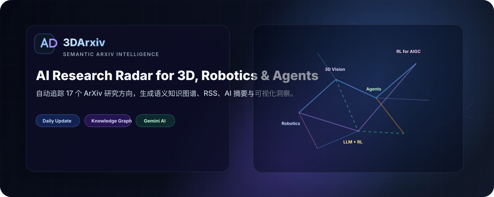
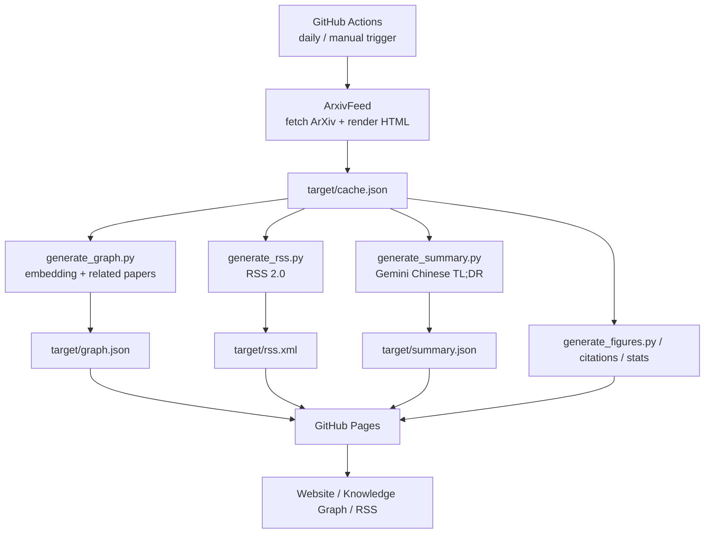

<p align="center">
  
</p>

<h1 align="center">3DArxiv</h1>

<p align="center">
  <strong>面向 3D Vision、Robotics、Embodied AI、AIGC 与 LLM Agents 的自动化 ArXiv 研究雷达。</strong>
</p>

<p align="center">
  <a href="https://github.com/Wastoon/3DArxiv/actions/workflows/update-feed.yml"></a>
  <a href="https://wastoon.github.io/3DArxiv/"></a>
  <a href="https://wastoon.github.io/3DArxiv/rss.xml"></a>
  <a href="LICENSE"></a>
</p>

<p align="center">
  <a href="https://wastoon.github.io/3DArxiv/"><strong>🌐 Live Site</strong></a>
  ·
  <a href="https://wastoon.github.io/3DArxiv/graph.html"><strong>🕸️ Knowledge Graph</strong></a>
  ·
  <a href="https://wastoon.github.io/3DArxiv/rss.xml"><strong>📡 RSS Feed</strong></a>
  ·
  <a href="#-部署你自己的版本"><strong>🚀 Deploy Your Own</strong></a>
</p>

---

## ✨ 项目定位

**3DArxiv** 是一个完全静态、由 GitHub Actions 自动驱动的研究情报系统。它每天从 ArXiv 拉取指定领域论文，生成可检索的论文列表、RSS Feed、AI 中文摘要，并基于语义向量构建知识图谱，用于快速发现论文之间的主题、作者与历史关联。

适合以下场景：

- 持续跟踪 3D Vision / Robotics / Embodied AI / AIGC / LLM Agents 最新论文；
- 通过语义知识图谱发现相关工作、研究脉络与潜在交叉方向；
- 用 RSS 或 Telegram 将每日论文流接入自己的研究工作流；
- Fork 后快速搭建团队/个人专属 ArXiv 监控站点。

---

## 🧭 核心能力

| 模块 | 能力 |
|---|---|
| 论文聚合 | 每日自动更新，追踪 17 个 ArXiv 方向；支持历史缓存与跨领域去重提示 |
| 智能筛选 | 标题、作者、摘要、领域全文搜索；子方向标签；精选论文过滤 |
| AI 摘要 | Gemini 自动生成中文 TL;DR，帮助快速判断论文价值 |
| 语义知识图谱 | Gemini Embedding + Canvas 力导向布局，展示语义相似、历史关联与共同作者边 |
| 个人工作流 | 收藏夹、阅读状态、笔记、BibTeX 复制、永久链接、RSS 订阅 |
| 自动发布 | GitHub Actions 定时构建，GitHub Pages 零服务器部署 |

---

## 🖥️ 产品体验

- **论文列表页**：按日期与领域组织论文，支持全文检索、标签筛选、精选过滤、BibTeX 复制、收藏与笔记；
- **统计面板**：查看每日论文数量趋势、领域分布、精选论文占比和访问数据；
- **知识图谱页**：通过动态力导向图探索论文之间的语义相似、历史关联与共同作者关系；
- **订阅与推送**：提供 RSS 2.0 Feed，并支持 Telegram 每日摘要推送。

> 最新界面请直接访问 [Live Site](https://wastoon.github.io/3DArxiv/) 与 [Knowledge Graph](https://wastoon.github.io/3DArxiv/graph.html)。

---

## 📚 当前追踪领域

| 领域 | 每日上限 | 说明 |
|---|---:|---|
| Robotics (`cs.RO`) | 300 | 机器人学全领域 |
| 3D Vision | 120 | 3D 重建、多视角、点云等方向 |
| NeRF | 80 | Neural Radiance Field 与神经渲染 |
| Gaussian Splatting | 60 | 3D Gaussian Splatting 及相关表示 |
| Digital Human | 80 | 数字人、人体渲染、人体重建 |
| Gaussian Avatar | 80 | Gaussian Avatar、4D Gaussian、SMPL |
| Human Body | 60 | 人体重建、姿态估计、参数化人体模型 |
| Video World Models | 100 | 视频世界模型与生成式环境建模 |
| Embodied Intelligence | 50 | 具身智能、VLA、灵巧操作 |
| End-to-End AD | 50 | 端到端自动驾驶、BEV、Occupancy、规划 |
| Foundation Models | 50 | 多模态基础模型与通用智能体 |
| RL for AIGC | 50 | AIGC / 生成式模型中的强化学习、奖励模型与偏好优化 |
| LLM Agents with Reinforcement Learning | 50 | LLM Agent、工具使用、规划、交互与强化学习 |
| Computation and Language (`cs.CL`) | 150 | NLP 与语言模型 |
| Information Retrieval (`cs.IR`) | 150 | 信息检索与搜索系统 |
| Machine Learning (`cs.LG`) | 150 | 机器学习通用方向 |
| Multimedia (`cs.MM`) | 150 | 多媒体理解、生成与检索 |

---

## 🕸️ Knowledge Graph

知识图谱用于把每日论文从“线性列表”升级为“可探索网络”：

- **语义相似边**：基于 Gemini Embedding 计算论文间语义距离；
- **历史关联边**：对新论文进行 ArXiv 相关论文回溯，连接早期相关工作；
- **共同作者边**：显示新论文之间的作者交集；
- **动态力导向布局**：支持缩放、拖拽节点、筛选标签、时间轴过滤和详情侧栏；
- **节点编码**：本周新论文与历史论文使用不同视觉样式，精选/顶会论文高亮展示。

访问：[https://wastoon.github.io/3DArxiv/graph.html](https://wastoon.github.io/3DArxiv/graph.html)

---

## 🏗️ 系统架构



### 技术栈

- **Frontend**：Static HTML / CSS / JavaScript、Canvas 2D、Chart.js、KaTeX、Remix Icon；
- **Pipeline**：Python 3.11、ArxivFeed、GitHub Actions、GitHub Pages；
- **AI**：Gemini `gemini-2.0-flash`（摘要）与 `gemini-embedding-001`（语义向量）；
- **Persistence**：`cache.json` 发布到 Pages，`data/embeddings.json` 通过 Actions cache 持久化。

---

## 🚀 部署你自己的版本

### 1. Fork 仓库

点击右上角 **Fork**，复制到你的 GitHub 账号下。

### 2. 配置 `config.toml`

修改站点名称、缓存地址与追踪领域：

```toml
site_title = "MyArxiv"
limit_days = 30
cache_url  = "https://<github_username>.github.io/<repo>/cache.json"

[[sources]]
limit = 50
category = "cs.RO"
title = "Robotics"
```

> `category` 支持 ArXiv API 查询语法，复杂查询建议控制 `limit`，并避免过宽泛条件。

### 3. 配置 GitHub Secrets

进入 **Settings → Secrets and variables → Actions** 添加：

| Secret | 用途 | 必须 |
|---|---|---|
| `GEMINI_API_KEY` | 生成 AI 摘要与语义知识图谱 | 推荐 |
| `TELEGRAM_BOT_TOKEN` | Telegram Bot 推送 | 可选 |
| `TELEGRAM_CHAT_ID` | Telegram 推送目标会话 | 可选 |
| `UMAMI_API_TOKEN` | 站点访问统计 | 可选 |

没有 `GEMINI_API_KEY` 时，摘要能力不可用；知识图谱会尽可能降级使用本地相似度逻辑。

### 4. 开启 GitHub Pages

在 **Settings → Pages** 中选择 `gh-pages` 分支作为发布源。

### 5. 触发首次构建

进入 **Actions → Update → Run workflow** 手动触发。之后工作流会按计划每天自动更新。

---

## ⚙️ 自动化工作流

项目的每日更新由 `.github/workflows/update-feed.yml` 驱动：

1. 下载并缓存 ArxivFeed；
2. 串行请求 ArXiv API，避免触发限流；
3. 生成静态首页与 `cache.json`；
4. 恢复并更新 Embedding cache；
5. 生成知识图谱、RSS、AI 摘要、论文首图、引用关系与访问统计；
6. 发布到 GitHub Pages；
7. 可选发送 Telegram 每日摘要。

---

## 🗂️ 项目结构

```text
3DArxiv/
├── config.toml                    # ArxivFeed 主配置：站点、缓存、领域查询
├── includes/
│   └── index.hbs                  # 首页 Handlebars 模板
├── statics/
│   ├── index.css                  # 首页样式
│   ├── index.js                   # 搜索、筛选、收藏、统计等前端逻辑
│   └── graph.html                 # 知识图谱页面
├── scripts/
│   ├── config.rhai                # 标题、作者、会议高亮配置
│   ├── run_arxivfeed_serial.py    # Actions 中串行运行 ArxivFeed，规避 ArXiv 限流
│   ├── generate_graph.py          # 语义知识图谱生成
│   ├── generate_rss.py            # RSS Feed 生成
│   ├── generate_summary.py        # AI TL;DR 生成
│   ├── generate_figures.py        # 论文首图抓取
│   ├── generate_citations.py      # 引用关系抓取
│   └── notify_telegram.py         # Telegram 推送
├── data/
│   └── README.md                  # 数据目录说明，embedding 缓存由 CI 维护
└── .github/workflows/
    └── update-feed.yml            # 每日更新与发布工作流
```

---

## 🔧 自定义建议

- **调整关注领域**：修改 `config.toml` 中的 `[[sources]]`；
- **新增高亮关键词**：编辑 `scripts/config.rhai`；
- **扩展前端标签**：修改 `statics/index.js` 的 `TAG_RULES`；
- **扩展图谱标签**：修改 `scripts/generate_graph.py` 的 `TAG_RULES`；
- **调整页面样式**：修改 `statics/index.css` 与 `includes/index.hbs`。

---

## 🙏 致谢

本项目基于 [MyArxiv](https://github.com/MLNLP-World/MyArxiv) 模板演进，并由 [ArxivFeed](https://github.com/NotCraft/ArxivFeed) 提供核心抓取与渲染能力。感谢 ArXiv、Semantic Scholar、Google Gemini 与 GitHub Pages 生态提供的开放基础设施。

---

<p align="center">
  <sub>Built for researchers who want a calmer, smarter, and more connected ArXiv workflow.</sub>
</p>
